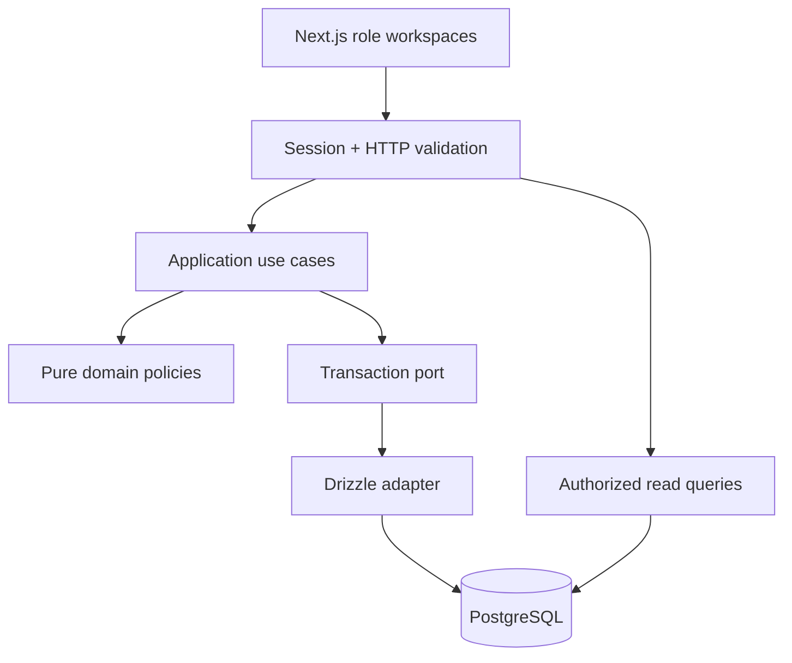
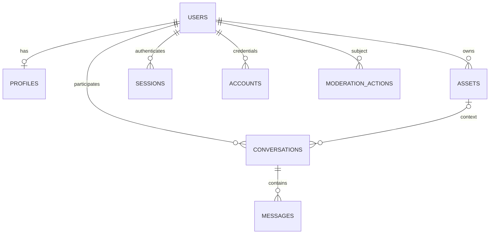
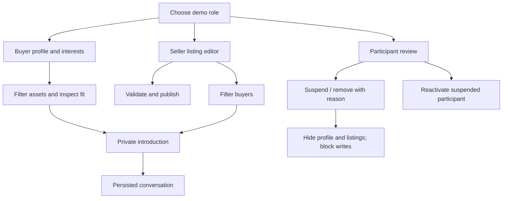

# Architecture and user flows

## Invariants

- Role and identity come from the authenticated DB user, never submitted form fields.
- Transaction locks cover both participants for contact and actor/target for moderation in sorted ID order.
- Removal preserves foreign keys and audit history; reactivation of removed users is forbidden.
- Visibility is computed from asset and owner status, so suspension does not destructively rewrite listing state.
- EUR, USD, GBP and PLN minor units are validated on input and constrained in SQL. A cached dated Frankfurter rate snapshot converts amounts in discovery and matching; stored amounts remain native.
- Conversation pair and sender/nonce uniqueness are enforced by PostgreSQL.
- Reads expose explicit projections, not auth records. Manager oversight does not grant inbox access.
